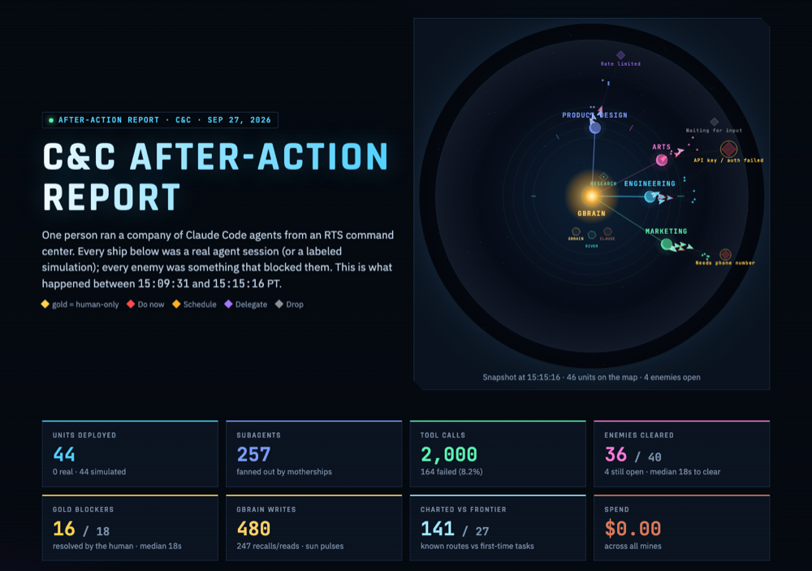

# C&C: Command and Control for AI agent companies

**C&C is a real-time-strategy command center for a company run by Claude Code agents.** Every agent session is a ship.
Every department is a planet orbiting a sun made of the company's shared memory. Anything that blocks the agents
(a missing token, an account signup, an approval) is an enemy at the edge of the map. One person watches the whole
swarm, sees what's stuck and why, and sends units to clear it, or clears the gold (human-only) enemies themselves.
At the kickoff, QM's team said nobody has figured out how to visualize swarms. This is our answer: an RTS map shows
dependencies, blockers, resources and attention at once, and it scales from one agent to hundreds.

> _Demo video / GIF: **[placeholder: link added at submission]**_



## How it works

```
Claude Code agents (Superset worktrees)
   │  HTTP hooks: SessionStart, UserPromptSubmit, Pre/PostToolUse, Subagent*, Stop, StopFailure, Notification, PermissionRequest
   ▼
C&C server (Bun, :7777) ── world reducer: hooks → units, subagents, enemies, planets, mines
   │   plugins: brains (summaries, triage, ranking, commander) · ops (Superset, transcripts, GBrain, Memorable, River)
   ▼  WebSocket, 4 Hz
Pixi.js map: sun, planets on cycle orbits, ships, tethers, enemies, mines, research station
```

- **Units = agents.** A main session is a mothership, and its subagents fly out and dock back on dashed tethers. Color = project,
  silhouette = model tier. Hooks drive everything: a tool call moves the ship, `Stop` docks it, and a failure chips its health.
- **Superset launches units.** "Deploy" in C&C (or `scripts/colonize.ts`) creates a Superset workspace plus an agent, and prompts reach
  the agent through `superset terminals send`. The swarm that built C&C shows up on its own Engineering planet.
- **GBrain is the sun.** Every GBrain read or write pulses the sun and brightens that department's energy beam. Planets grow
  as their `company/<dept>/` pages accumulate. Click the sun to explore the company's memory graph.
- **Memorable charts routes.** A task kind with a recalled procedure flies a charted lane with an ETA. First-time work
  heads into the fog of the frontier.
- **River Sentinel + Research Center.** New blockers are classified (kind, Eisenhower quadrant, human-only, department,
  tier) by our own model, fine-tuned on River. Its card shows base vs trained. Human corrections feed **Retrain** in the Research Center.
- **Enemies merge by cause.** Five agents missing the same `GITHUB_TOKEN` make one big gold enemy with five tethers.
  Select it and units rank green→red by fit. Send the best, or resolve it yourself, and the blocked ships resume.
- **LLM calls** (summaries, ranking, commander) run on **headless Claude Code** under the user's subscription. There is no API key in the repo.

## Sponsors

| Sponsor | What it does in C&C | Where to see it |
|---|---|---|
| **GBrain** | The company brain (hosted gbrain.io): agents recall on spawn and remember on finish; plus a new skill, [`sprint-retro`](app/gbrain-skills/sprint-retro/SKILL.md) | The sun, energy beams, the memory explorer, planet growth, `company/<dept>/retros/` |
| **Superset** | The engine: spawns every agent in its own worktree and delivers prompts. C&C itself was built by a Superset swarm | Deploying from the map; the after-action report as a **Superset Page** |
| **River** | Fine-tunes the Sentinel, our own "System One" blocker classifier, and serves the base-vs-trained eval | The Sentinel unit, its card, the Research Center |
| **Memorable** | Procedural memory: known task kinds become charted lanes and veteran ships | Lanes vs fog, the veteran badge |
| QM, UFO | Not integrated. QM's "nobody can visualize swarms" framed the pitch | — |

## What's real vs simulated

| Real (live) | Simulated (labeled SIMULATED on screen) |
|---|---|
| Claude Code agents via HTTP hooks: the build swarm plus the colonization motherships | The scale shot (hundreds of units, from `server/sim.ts`) |
| Spawning and prompting through the Superset CLI | The galaxy of companies (vision close) |
| GBrain reads and writes, page counts, the memory graph | Mines we can't meter (River and GBrain credit, entered by hand) |
| Token spend and context usage, from agent transcripts | Factory ticks while the scheduler is paused |
| AI summaries, ranking and the commander (headless Claude) | |
| The River-trained Sentinel with its base-vs-trained eval | |
| Memorable recall hits → charted lanes | |

## Run it

```bash
cd app && bun install
bun run dev                      # C&C on http://localhost:7777 (hooks → POST /hook)
bun run sim                      # optional: synthetic agents (marked SIMULATED)
bun scripts/colonize.ts          # launch one real mothership per planet (--dry-run, --planet marketing)
bun scripts/report.ts --publish  # write app/report/index.html and publish it as a Superset Page
```

Real agents report in through the HTTP hooks in `.claude/settings.json`. Any Claude Code session started in this repo, or in
a Superset worktree of it, appears on the map. River: `app/river/` (sidecar on `:7788`, see its README).

## Repo map

| Path | What |
|---|---|
| `app/server/` | Bun server: `world.ts` (hooks → world reducer), `index.ts` (plugin host, REST + WS), `plugins/` (brains, ops, memory), `sim.ts` |
| `app/web/` | Pixi.js map (`scene/`), console and panels (`ui/`), memory explorer (`memory/`) |
| `app/shared/types.ts` | The data contract between server and client |
| `app/river/` | Sentinel dataset, training, eval and sidecar (River) |
| `app/scripts/` | `colonize.ts` (the initial population round), `report.ts` (the after-action report) |
| `app/gbrain-skills/` | The `sprint-retro` GBrain skill + install notes |
| `company/` | What the agent company produces, one folder per planet (engineering, marketing, design, arts) |
| `kb/` | Hackathon knowledge base: sponsor cheat sheets, architecture decisions, submission draft |

## Credits

- Art: [Kenney](https://kenney.nl) space packs (CC0) and [Screaming Brain Studios](https://screamingbrainstudios.itch.io) nebulae (CC0).
- Fonts: Rajdhani, IBM Plex Sans, JetBrains Mono (Google Fonts, OFL).
- "C&C" is a name-only nod to *Command & Conquer*. No EA logos, fonts or art are used.
- Built at the YC "Own Your Intelligence" hackathon (Sep 27, 2026) by a human plus a swarm of Claude Code agents running in Superset.
